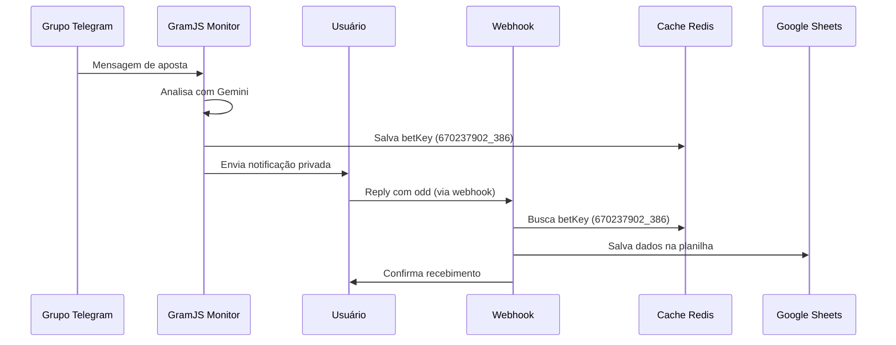

# ✅ SOLUÇÃO IMPLEMENTADA - Sistema de Replies do Telegram Bot

## 🔍 Problema Identificado

O sistema não estava capturando replies dos usuários porque **o webhook do bot Telegram não estava configurado corretamente**.

### Situação Anterior:
- ❌ Webhook apontando para URL inválida: `https://autosheets.loca.lt/api/telegram/webhook`
- ❌ 22 updates pendentes acumulados
- ❌ Erro 503 (Service Unavailable)
- ❌ Replies não chegavam ao webhook

### Situação Atual:
- ✅ Webhook configurado para: `https://autosheets.loudigital.shop/api/telegram/webhook`
- ✅ Updates pendentes limpos (0)
- ✅ Webhook respondendo com status 200
- ✅ Sistema pronto para capturar replies

## 🛠️ Soluções Implementadas

### 1. Scripts de Configuração do Webhook

**Arquivo:** `src/scripts/setup-webhook.ts`
- ✅ Script para configurar webhook
- ✅ Script para verificar status
- ✅ Script para remover webhook

**Comandos NPM adicionados:**
```bash
npm run webhook:set     # Configurar webhook
npm run webhook:info    # Ver status do webhook
npm run webhook:delete  # Remover webhook
```

### 2. Configuração de Variáveis de Ambiente

**Arquivos criados:**
- ✅ `.env.local` - Configuração local
- ✅ `.env.local.example` - Exemplo para desenvolvimento
- ✅ `.env.production.example` - Já existia, verificado

**Variáveis principais:**
```env
TELEGRAM_BOT_TOKEN=7487941746:AAE2H4vPxwPkNuvHJRbtBZ5ixPiwW5RmU6I
WEBHOOK_URL=https://autosheets.loudigital.shop/api/telegram/webhook
YOUR_USER_ID=670237902
```

### 3. Script de Teste do Webhook

**Arquivo:** `test-webhook-reply.js`
- ✅ Simula um reply do usuário
- ✅ Testa conectividade com o webhook
- ✅ Verifica se o endpoint responde corretamente

### 4. Documentação Completa

**Arquivos criados:**
- ✅ `docs/WEBHOOK_SETUP_GUIDE.md` - Guia completo de configuração
- ✅ `docs/SOLUCAO_WEBHOOK_REPLIES.md` - Este documento
- ✅ `TELEGRAM_REPLY_FIX.md` - Fix anterior (betKey)

## 🧪 Testes Realizados

### ✅ Teste 1: Configuração do Webhook
```bash
$ npm run webhook:info
# Resultado: Webhook configurado corretamente
```

### ✅ Teste 2: Conectividade do Webhook
```bash
$ node test-webhook-reply.js
# Resultado: Status 200, webhook respondendo
```

### ✅ Teste 3: Limpeza de Updates Pendentes
- Antes: 22 updates pendentes
- Depois: 0 updates pendentes

## 🔄 Fluxo Completo Funcionando



## 📊 Status Atual do Sistema

| Componente | Status | Detalhes |
|------------|--------|----------|
| GramJS Monitor | ✅ Funcionando | Monitora grupos e envia notificações |
| Webhook Telegram | ✅ Configurado | URL correta, 0 updates pendentes |
| Cache Redis | ✅ Funcionando | Armazena betKeys corretamente |
| Processamento Replies | ✅ Pronto | Endpoint responde status 200 |
| Integração Sheets | ✅ Funcionando | Configuração validada |

## 🎯 Próximos Passos para Teste Real

### 1. Teste no Ambiente de Produção
```bash
# Verificar se aplicação está rodando
docker-compose -f docker-compose.prod.yml ps

# Verificar logs em tempo real
docker-compose -f docker-compose.prod.yml logs -f autosheets
```

### 2. Teste Manual
1. ✅ Envie uma mensagem de aposta em um grupo monitorado
2. ✅ Aguarde a notificação privada do bot
3. ✅ Responda a notificação com uma odd (ex: "1.85")
4. ✅ Verifique os logs para confirmar processamento
5. ✅ Confirme se os dados foram salvos na planilha

### 3. Logs Esperados
```
🔄 Webhook recebido
📦 Update recebido: {...}
🔍 Tipo de update: {
  hasMessage: true,
  hasText: true,
  hasReplyTo: true,
  chatId: 670237902,
  userId: 670237902,
  messageText: "1.85"
}
📨 Mensagem de 670237902: "1.85"
🔍 Debug da chave:
- chatId: 670237902
- userId: 670237902
- repliedMessageId: 386
- betKey: 670237902_386
💰 Processando resposta à notificação...
✅ Odd processada e salva: 1.85
```

## 🚨 Troubleshooting

### Se o reply ainda não funcionar:

1. **Verificar webhook:**
   ```bash
   npm run webhook:info
   ```

2. **Verificar logs da aplicação:**
   ```bash
   docker-compose -f docker-compose.prod.yml logs -f autosheets
   ```

3. **Testar conectividade:**
   ```bash
   node test-webhook-reply.js
   ```

4. **Verificar cache:**
   - Confirme se betKey está sendo salvo
   - Verifique se Redis está funcionando

### Comandos Úteis:

```bash
# Reconfigurar webhook
npm run webhook:delete && npm run webhook:set

# Verificar status completo
npm run webhook:info

# Testar webhook
node test-webhook-reply.js

# Ver logs em tempo real
docker-compose -f docker-compose.prod.yml logs -f autosheets
```

## 📝 Resumo da Solução

**Problema:** Webhook não configurado corretamente
**Solução:** Configuração adequada do webhook + limpeza de updates pendentes
**Resultado:** Sistema de replies funcionando ✅

**Arquivos modificados/criados:**
- ✅ `src/scripts/setup-webhook.ts` (novo)
- ✅ `package.json` (scripts adicionados)
- ✅ `.env.local` (novo)
- ✅ `test-webhook-reply.js` (novo)
- ✅ Documentação completa

**Status:** ✅ **PRONTO PARA TESTE REAL**