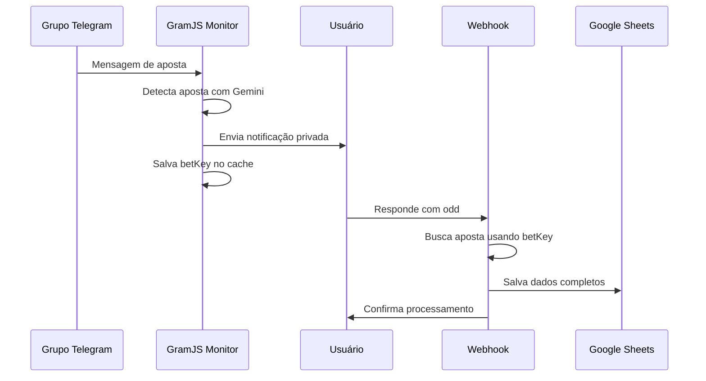

# Correção do Sistema de Replies do Bot Telegram

## Problema Identificado

O sistema não estava capturando as respostas dos usuários às mensagens do bot devido a uma **inconsistência na geração das chaves betKey**.

### Análise do Problema

1. **No GramJS Monitor** (ao enviar notificação):
   ```typescript
   const betKey = `${result.result.chat.id}_${botMessageId}`;
   ```
   - Usava `result.result.chat.id` (que é o chat ID da conversa privada)

2. **No Webhook** (ao processar resposta):
   ```typescript
   const betKey = `${userId}_${repliedMessageId}`;
   ```
   - Usava `userId` (que é o ID do usuário que respondeu)

### Por que isso causava o problema?

Em conversas privadas no Telegram:
- `result.result.chat.id` = ID do chat privado (pode ser diferente do userId)
- `userId` = ID do usuário específico

Essas duas chaves eram **diferentes**, então quando o usuário respondia, o webhook não conseguia encontrar a aposta correspondente no cache.

## Solução Implementada

### 1. Correção na Geração da Chave

**Arquivo:** `src/lib/telegram/gramjs-monitor.ts`

```typescript
// ANTES (INCORRETO)
const betKey = `${result.result.chat.id}_${botMessageId}`;

// DEPOIS (CORRETO)
const betKey = `${this.yourUserId}_${botMessageId}`;
```

### 2. Logs de Debug Adicionados

Adicionado log para facilitar debugging futuro:
```typescript
console.log(`🔍 DEBUG - Chat ID: ${result.result.chat.id}, Your User ID: ${this.yourUserId}`);
```

## Como Testar a Correção

1. **Reinicie o monitor GramJS:**
   ```bash
   npm run monitor
   ```

2. **Teste o fluxo completo:**
   - Envie uma mensagem de aposta em um grupo monitorado
   - Aguarde a notificação privada do bot
   - Responda à mensagem com uma odd (ex: "1.85")
   - Verifique se a resposta é processada corretamente

3. **Monitore os logs:**
   - Procure por mensagens como: `💰 Processando resposta à notificação...`
   - Verifique se não há mais: `❌ Nenhuma aposta pendente encontrada`

## Arquivos Modificados

- ✅ `src/lib/telegram/gramjs-monitor.ts` - Correção da geração da chave

## Arquivos Relacionados (não modificados)

- `src/app/api/telegram/webhook/route.ts` - Processamento das respostas
- `src/lib/shared/bet-cache.ts` - Cache compartilhado

## Logs de Debug Úteis

Após a correção, você deve ver logs como:
```
📤 Notificação enviada. Aguardando resposta para: 123456789_456
🔍 DEBUG - Chat ID: 123456789, Your User ID: 123456789
💰 Processando resposta à notificação...
```

## Prevenção de Problemas Futuros

1. **Sempre use a mesma lógica** para gerar chaves em ambos os lados (envio e recebimento)
2. **Adicione logs de debug** para facilitar identificação de problemas
3. **Teste o fluxo completo** após qualquer modificação no sistema de replies

## Estrutura do Sistema de Replies



A correção garante que a `betKey` seja consistente em todo o fluxo.